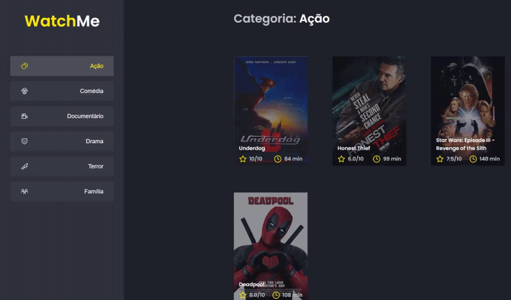

<h1 align="center">Ignite Challenge 02 - Refactoring App</h1>

<div align="center">



</div>

---

<p align="center"> A challenge to Refactor the project, moving all the content of App.tsx to SideBar and Content components.
    <br> 
</p>

## 📝 Table of Contents

- [About](#about)
- [Getting Started](#getting_started)

## 🧐 About <a name = "about"></a>

This challenge is part of Ignite by [@Rocketseat](https://github.com/Rocketseat), which aims to speed up the learning as a front-end developer using ReactJS.

In the first chapter, I was introduced to React and componentization. This challenge has as main focus to move the content that is all in the App.tsx to its respective components. With that, I learned important topics like Components and Properties in React.

## 🏁 Getting Started <a name = "getting_started"></a>

These instructions will get you a copy of the project up and running on your local machine for development and testing purposes.

### How to clone the project:

A step by step series of examples that tell you how to get a development env running.

First you have to run a git clone cli to clone the project: 

```
git clone https://github.com/lucas-hgs/desafio02-componentizando-a-aplicacao
```

After that, you have install all the modules that is necessary to run the project.

If you're using Yarn:

```
yarn
```

In case if you're using npm, please use:

```
npm install
```

After installing all the modules necessary to run the application, you'll need to use 2 specific commands to run this application.

The first one is responsible to run a local server, that way you can use the API to fetch the movies inside of the application:

```
yarn server
```

The second one is to run the application as a development environment:

```
yarn dev
```

Note:
>You have to run these commands on the Terminal

Please, let me know if you have any question.